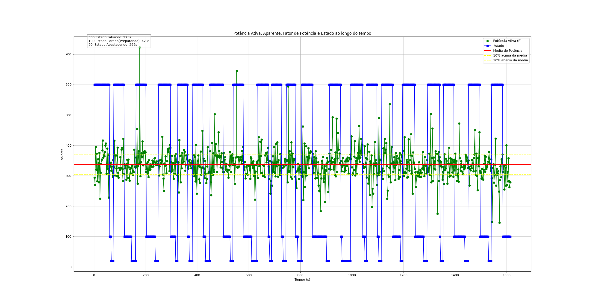

Valores adquiridos do equipamento no formato:

Vrms: 205.22 v;   Irms: 4.58 A;  P: 293.65 W;  S: 940.04 VA;  FP: 0.31;  At(sample): 2Qnt: 0; 
Vrms: 191.13 v;   Irms: 5.11 A;  P: 270.29 W;  S: 977.37 VA;  FP: 0.28;  At(sample): 2Qnt: 0; 
Vrms: 211.87 v;   Irms: 5.73 A;  P: 394.99 W;  S: 1214.36 VA;  FP: 0.33;  At(sample): 2Qnt: 0; 
Vrms: 203.78 v;   Irms: 4.78 A;  P: 320.24 W;  S: 974.75 VA;  FP: 0.33;  At(sample): 3Qnt: 0; 
Vrms: 224.64 v;   Irms: 5.27 A;  P: 373.19 W;  S: 1184.22 VA;  FP: 0.32;  At(sample): 2Qnt: 0; 
Vrms: 202.10 v;   Irms: 4.33 A;  P: 282.24 W;  S: 876.00 VA;  FP: 0.32;  At(sample): 2Qnt: 0; 
Vrms: 209.65 v;   Irms: 4.87 A;  P: 354.39 W;  S: 1021.49 VA;  FP: 0.35;  At(sample): 2Qnt: 0; 
Vrms: 207.86 v;   Irms: 4.95 A;  P: 341.66 W;  S: 1029.74 VA;  FP: 0.33;  At(sample): 2Qnt: 0; 

Alterados através do arquivo ChangeTableToCSV.py, ficando no seguinte formato:

Vrms,Irms,P,S,FP,At_sample,Qnt,Estado
205.22,4.58,293.65,940.04,0.31,2,0,Inicio
191.13,5.11,270.29,977.37,0.28,2,0,Inicio
211.87,5.73,394.99,1214.36,0.33,2,0,Inicio
203.78,4.78,320.24,974.75,0.33,3,0,Inicio
224.64,5.27,373.19,1184.22,0.32,2,0,Inicio
202.1,4.33,282.24,876.0,0.32,2,0,Inicio
209.65,4.87,354.39,1021.49,0.35,2,0,Inicio
207.86,4.95,341.66,1029.74,0.33,2,0,Inicio
202.71,4.42,278.1,896.33,0.31,2,0,Inicio
207.75,5.35,374.99,1110.93,0.34,2,0,Inicio

Processado com o arquivo CSV_To_Graphics.py, apresentando o seguinte gráfico:

